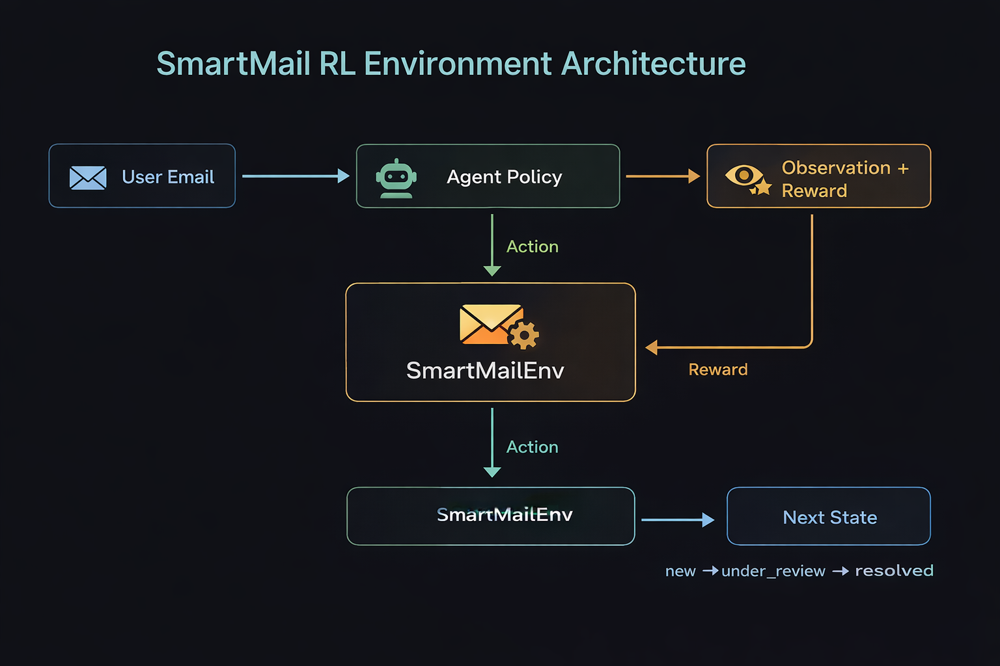

# SmartMail Environment
### Real-World OpenEnv RL Benchmark for Intelligent Email Triage & Customer Support Workflows

SmartMail is a **production-inspired OpenEnv reinforcement learning environment** designed for training and evaluating AI agents on realistic **enterprise email triage, escalation, and risk-sensitive customer support workflows**.



Built for the **Meta PyTorch × Hugging Face OpenEnv Hackathon**, this environment simulates real-world support operations performed by human teams in e-commerce, fintech, and SaaS businesses.

---

## Motivation
Modern organizations handle thousands of support tickets and emails daily.

Human agents routinely perform tasks such as:

- refund complaint resolution
- package delay escalation
- billing failure classification
- suspicious login / phishing triage
- fraud complaint escalation
- VIP customer retention
- spam / risk-sensitive routing

SmartMail provides a realistic RL benchmark for evaluating whether AI agents can learn these workflows using standard OpenEnv APIs.

## RL Workflow Architecture
```
                                    Incoming Email
                                          ↓
                                   Observation Space
                               (subject + body + status)
                                          ↓
                                     Agent Action
                      (classify / escalate / resolve / mark_spam)
                                          ↓
                                  Environment Step
                                   (step(action))
                                          ↓
                                    Reward Signal
                      (partial + completion + risk-aware shaping)
                                          ↓
                                  Next State / Done
```
## Observation Space

### Each observation contains:
```
{
    "email_subject": str,
    "email_body": str,
    "current_status": str
}
```
### Example:
```
{
    "email_subject": "Refund not received",
    "email_body": "I requested a refund 5 days ago...",
    "current_status": "new"
}
```
## Action Space

### Supported actions:

- classify
- escalate
- resolve
- mark_spam

### Example:
```
Action(
    action_type="escalate",
    label="refund_issue"
)
```
## Task Difficulty Levels

### Easy
- refund not received
- package delayed
### Medium
- payment failed
- suspicious login / phishing
### Hard
- VIP client retention
- fraud complaint
- spam + security mixed risk
- Urgent premium escalation

## Reward Design

### SmartMail uses progressive reward shaping:

- correct action → positive reward
- correct label → positive reward
- difficulty bonus → scaled reward
- critical priority → escalation bonus
- wrong action → penalty
- safe bounded score → strictly within (0,1)

This creates meaningful RL learning signal across trajectory steps.

## OpenEnv API Support

### Implemented APIs:

- reset()
- step(action)
- state()

Fully compatible with OpenEnv validation.

---
## Project Structure
```
smartmail_env/
│
├── env/
│   ├── environment.py      # Core RL environment logic
│   ├── models.py           # Typed Observation and Action models
│   ├── tasks.py            # Task definitions (easy → hard)
│   ├── graders.py          # Reward and grading logic
│
├── server/
│   └── app.py              # Hugging Face Space API server
│
├── inference.py            # Baseline agent rollout script
├── Dockerfile              # Container deployment
├── openenv.yaml            # OpenEnv metadata and spec
├── README.md               # Documentation
└── requirements.txt        # Python dependencies
```
---
##  Baseline Inference

The baseline agent uses OpenAI client + injected proxy API.

It performs multi-task rollout over multiple difficulty levels and produces reproducible structured stdout logs.

### Example:
```
[START]
[STEP]
[END]
```    
---
##  Run Locally
```
python inference.py
```
### Docker
```
docker build -t smartmail-env .
docker run --rm smartmail-env
```
## Validation
```
openenv validate
```

## Live Deployment:

- **GitHub:** https://github.com/Techmirage7/smartmail-env
- **HF Space:** https://huggingface.co/spaces/DuniyakaPAPA007/smartmail-env

## Built With
- OpenEnv
- FastAPI
- Docker
- Hugging Face Spaces
- Python 3.12